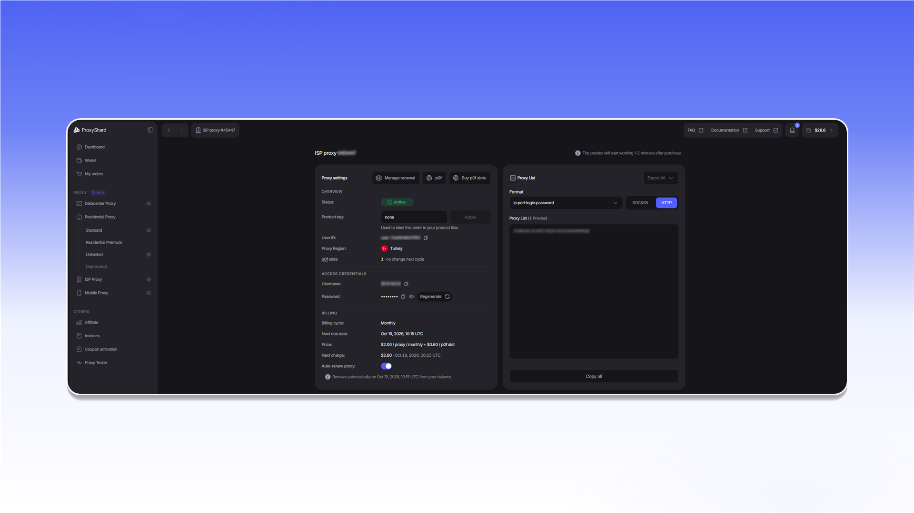

# ISP 代理

<mark style="color:purple;">ISP 代理</mark>与<mark style="color:purple;">数据中心代理</mark>一样，每个地址仅分配给一名用户，不存在隐藏共享。这些地址均为 <mark style="color:purple;">IPv4</mark>，并支持 <mark style="color:purple;">UDP</mark>。

<mark style="color:purple;">ISP 代理</mark>兼具<mark style="color:purple;">住宅代理</mark>和<mark style="color:purple;">数据中心代理</mark>的优点。它们与数据中心代理一样稳定且采用静态地址，但 IP 注册在家庭互联网服务提供商名下。

因此，ISP 代理适合对 <mark style="color:purple;">IP</mark> 类型敏感的 Tier-1 网站和服务。借助 <mark style="color:purple;">UDP</mark> 支持，还可用于 WebRTC 及其他基于 UDP 的场景。

ISP 代理支持 <mark style="color:purple;">p0f</mark> 网络指纹伪装。



购买和付款的分步说明：[购买 ISP / 数据中心代理](../site-navigation/buying-and-renewing/buying-datacenter-proxies.md)。

## 特性

| 参数              | 值                                   |
| --------------- | ------------------------------------ |
| IP 类型           | IPv4（家庭宽带运营商）                |
| 共享              | 否 - 一个 IP 对应一个用户             |
| 连接数限制         | 每个 IP 2,500                       |
| [UDP 支持](about-udp/) | ✓                              |
| [p0f 支持](p0f-spoofing.md) | ✓（+$0.6 / IP 每月）          |
| 价格              | **$2** / IP 每月                      |

## 可用位置

| 国家 |
| ------ |
| 🇹🇷 土耳其 |
| 🇺🇸 美国 |
| 🇨🇿 捷克 |
| 🇺🇦 乌克兰 |


位置列表正在不断扩充。


## 如何购买

1. 打开 `ISP Proxy`。
2. 在 `Proxy region` 中选择国家或地区。
3. 在 `Number of proxies` 中输入代理数量。
4. 如需自动续订订单，请启用 `Auto renew`。
5. 如有需要，请启用 `Enable p0f settings`。
6. 在 `Total slots` 中输入需要使用 p0f 伪装的代理数量。
7. 如有优惠码，请在 `Promocode` 中输入并点击 `Apply`。
8. 确认金额后点击 `Buy now`。

<figure>
  <picture>
    <source srcset="../.gitbook/assets/isp-purchase-form_black.png" media="(prefers-color-scheme: dark)">
    
  </picture>
</figure>

付款和续订步骤请参阅[购买 ISP / 数据中心代理](../site-navigation/buying-and-renewing/buying-datacenter-proxies.md)。


付款后请等待 1-2 分钟，订单同步完成后代理即可使用。


## 订单字段

<figure>
  <picture>
    <source srcset="../.gitbook/assets/isp-order-details_black.png" media="(prefers-color-scheme: dark)">
    
  </picture>
</figure>

* `Status` 显示订单状态：`Active`、`On-hold` 或 `Canceled`。
* `Product tag` 用于添加标签，方便在产品列表中查找订单。
* `User ID` 用于系统内部识别订单，联系支持时可能需要提供。
* `Proxy Region` 显示所选国家或地区。
* `p0f slots` 显示当前启用的 p0f 槽位数量，以及下一计费周期的变更。
* `Username` 和 `Password` 是代理凭据。点击 `Regenerate` 会生成新密码，已有代理连接字符串将失效。
* `Billing cycle`、`Next due date`、`Price` 和 `Next charge` 显示租用周期及下次付款信息。
* `Auto-renew proxy` 用于控制自动续订，也可以通过 `Manage renewal` 调整相同设置。
* `p0f` 和 `Buy p0f slots` 分别用于打开指纹伪装设置和购买额外槽位。
* 在 `Proxy List` 中可以选择 `HTTP` 或 `SOCKS5`、更改连接字符串格式、使用 `Copy all` 复制列表，或通过 `Export All` 下载列表。


状态为 `Canceled` 的订单无法恢复。订单欠费三天后会进入该状态。


## 适用于哪些任务

任何加密货币交易所、Polymarket、稳定的网页抓取会话、SEO 监控、电商价格监控、市场平台核查、广告验证（ad verification）、品牌监控、从家庭运营商 ASN 进行的网站测试、登录与用户场景的 QA、网站可用性监控、账户管理。

## ISP 代理的优缺点

#### <mark style="color:green;">优点：</mark>

* **真实的 ISP 地址** - IP 登记在真实的家庭互联网运营商名下（在地理定位数据库中 ASN 类型为运营商，而非托管）
* **可靠的家庭通信运营商**
* **宽带通道、延迟极低**
* **专属静态地址** - 整个租期内 IP 不变
* **支持 p0f 和 UDP**

#### <mark style="color:red;">缺点：</mark>

* **价格** - 高于数据中心代理
* **可用位置数量** - 与真实运营商的对接极其复杂，但我们在不断扩充列表


代理配置说明请参阅[设置指南](../setup-guides/getting-started.md)。

