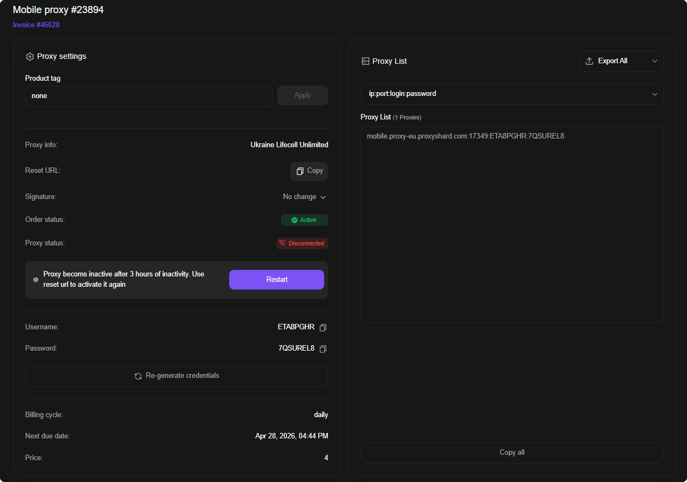

# 移动代理

<mark style="color:purple;">移动代理</mark>托管在配备真实 SIM 卡的路由器上。其连接的类型和质量与通过移动运营商的普通移动互联网完全相同 - 就像您手机上的网络一样。支持 <mark style="color:purple;">UDP</mark>，并提供丰富的地点和运营商选择。


**移动代理可在任何设备上工作。** “移动”一词仅指通过 SIM 卡连接的方式，而非终端设备的类型。无论是在 PC、笔记本还是反检测浏览器中，都同样好用。



**这是一款专业产品 - 面向了解其用途的用户。** 流量经由真实 SIM 卡传输，因此速度可能波动 - 这是正常现象，而非故障。如果不确定移动代理是否适合您的任务，请在 [live 聊天](../contact-us.md)中咨询，或考虑 [ISP 代理](isp-proxies.md)（速度稳定、家庭 IP）或[住宅代理](residential-proxies/README.md)（庞大的池、海量会话）。



1\) 设备指纹切换 (p0f) 并非在所有运营商中都可用。请参阅[限制](restrictions.md)页面上的完整限制列表。

2\) 不使用 VPN 的俄罗斯用户不可用。




## 特性

| 参数              | 值                                     |
| --------------- | ------------------------------------- |
| IP 类型           | 移动 IPv4                              |
| 共享              | 否 - 一个端口对应一个用户               |
| 流量              | 无限                                   |
| UDP 支持          | ✓                                     |
| p0f 支持          | ✓（并非所有位置可用，见上文）            |
| 价格              | 从 **$4** / 天 · 从 **$55** / 月        |

## 可用位置

| 国家 | 运营商 |
| ------ | --------- |
| 🇺🇸 美国 | T-Mobile (5G)、Verizon (5G, Colorado) |
| 🇬🇧 英国 | O2、Vodafone |
| 🇩🇪 德国 | O2、Vodafone |
| 🇫🇷 法国 | SFR (5G)、Bouygues Telecom (5G) |
| 🇮🇹 意大利 | Vodafone (5G)、WindTre (5G) |
| 🇪🇸 西班牙 | Digimobil、Movistar (5G)、Vodafone (5G) |
| 🇵🇹 葡萄牙 | NOS (5G) |
| 🇳🇱 荷兰 | Ziggo (5G)、Odido (5G) |
| 🇮🇪 爱尔兰 | Vodafone (5G)、Three (5G) |
| 🇵🇱 波兰 | T-Mobile (5G) |
| 🇺🇦 乌克兰 | Lifecell、Vodafone、Kyivstar |
| 🇲🇩 摩尔多瓦 | Moldcell、Moldtelecom |
| 🇨🇦 加拿大 | Rogers |
| 🇮🇩 印度尼西亚 | Telkomsel |


列表会定期扩充。最新位置与价格请见 [Mobile proxy](https://dashboard.proxyshard.com/en/mobile-proxy) 购买页面。


## **它们如何工作？**

首先，您需要[**购买**](https://dashboard.proxyshard.com/en/mobile-proxy)一个订单。进入页面.png>)并选择合适的国家和运营商。

<figure><figcaption></figcaption></figure>


购买后，请激活端口：在订单中点击 <mark style="color:purple;">**Restart**</mark>，或访问您的专属 <mark style="color:purple;">**Reset URL**</mark>。端口激活前，代理无法工作。


<figure><figcaption></figcaption></figure>

## 订单字段说明

让我们回顾一下 <mark style="color:purple;">order</mark> 字段：

<figure><figcaption></figcaption></figure>

<mark style="color:purple;">代理信息</mark> - 产品名称

<mark style="color:purple;">Reset URL</mark> - 用于更改连接上的 IP 地址的链接

<mark style="color:purple;">Login</mark> - 代理登录

<mark style="color:purple;">Password</mark> - 代理密码

<mark style="color:purple;">订单状态</mark> - 订单状态。可能的状态：

* <mark style="color:green;">**有效**</mark> - 有效订单
* <mark style="color:orange;">**保留**</mark> - 租赁期满后等待付款
* <mark style="color:red;">**已取消**</mark> - 已取消订单

<mark style="color:purple;">代理状态</mark> - 代理状态。可能的状态：

* <mark style="color:green;">**有效**</mark> - 有效订单
* <mark style="color:$danger;">Disconnected</mark> - 断开连接，非活动端口


**购买后或端口没有活动后，必须是**<mark style="color:$success;">**已激活**</mark>**。如果代理状态为**<mark style="color:$danger;">**已断开**</mark>**，则在您激活代理之前，代理将无法工作！**

**您可以通过 **<mark style="color:purple;">**重置 URL**</mark>** 或 **<mark style="color:purple;">**重新启动代理**</mark>** 按钮激活代理。**


<mark style="color:purple;">下一个到期日</mark> - 下一个收费日期

<mark style="color:purple;">复制代理</mark> - 用于将代理复制到剪贴板的按钮

<mark style="color:purple;">重新生成</mark> - 更改代理密码

<mark style="color:purple;">Restart</mark>--启动或更改IP；相当于 <mark style="color:purple;">Reset URL</mark> 地址

## 适用于哪些任务

社交网络与多账户管理、移动广告验证（mobile ad verification）、移动广告核查、大多数加密货币交易所、Polymarket、移动网站与应用测试、移动版网站抓取、移动搜索结果 SEO 监控、电商移动价格监控、地理定向内容测试、移动资费的旅行类抓取、移动环境下的品牌监控。

## 移动代理的优点和缺点

#### <mark style="color:green;">优点：</mark>

* **可选择具体运营商** - 通过所需的移动运营商接入
* **通过 Reset URL 更换 IP** - 轮换频率不超过每分钟一次
* **支持 p0f** - 大多数位置可用（见[限制](restrictions.md)）
* **支持 UDP**
* **灵活的租期** - 从一天到一个月
* **专属端口** - 一张 SIM 卡，一个用户

#### <mark style="color:red;">缺点：</mark>

* **可能出现速度下降** - 当运营商基站过载时 - 少见，但有可能
* **对新手而言较复杂的产品** - 建议购买前先在[支持](../contact-us.md)处咨询
* **在 macOS / iOS 上切换 p0f** 会因算法复杂而降低通道速度
* **动态 IP** - 地址可能随时由运营商主动切换
* **同时只能一个会话** - 一个端口保持一个 IP。如果需要_同时_连接多个设备（不是轮流，而是在同一时刻），请购买单独的端口或考虑[住宅代理](residential-proxies/README.md)


您可以在我们的[设置指南](../setup-guides/getting-started.md)部分了解如何配置代理。


