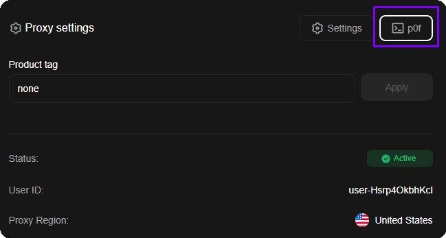
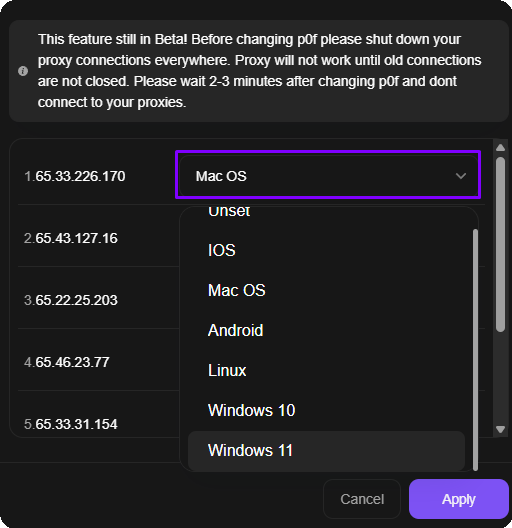

# 网络指纹伪装(p0f)

## p0f 是什么以及它为何重要

网络上的每个设备在 <mark style="color:$primary;">TCP/IP</mark> 级别都有自己的数字指纹，称为 <mark style="color:$primary;">**p0f**</mark>。它由网络堆栈参数组成：MSS、TSval、TTL、TCP 选项、窗口大小、TOS 等。这些参数在 Windows、macOS、Linux、iOS 和 Android 中有所不同，反欺诈系统知道这一点。

网站端检查的工作原理：

1. 网站查看<mark style="color:$primary;">**用户代理**</mark>、<mark style="color:$primary;">**TLS 指纹**</mark>和其他客户端参数来确定用户来自哪个操作系统。
2. 同时，分析连接的<mark style="color:$primary;">**网络层**</mark>，即代理服务器与您的流量一起发送的 <mark style="color:$primary;">TCP/IP 指纹</mark>。
3. 如果浏览器显示“我是Windows 11”，但TCP/IP指纹显示<mark style="color:$primary;">Linux</mark>，则反欺诈系统会记录不匹配。

**所有代理服务的问题是**所有数据中心和 ISP 代理都在 Linux 服务器上运行。这意味着在 99% 的情况下，即使您从 Windows 或 macOS 进行访问，您的网络指纹也将是 Linux。对于反欺诈系统，这是正在使用代理的直接信号。

## ProxyShard 如何解决这个问题

我们添加了直接从仪表板**伪装 p0f 指纹**的功能。您选择所需的操作系统，代理服务器开始发送带有相应 TCP/IP 指纹的网络数据包。

可用的伪装选项：

| 值 | 描述 |
| -------------- | --------------------------- |
| **Unset**      |默认指纹（Linux）|
| **Windows 10** | Windows 10 指纹 |
| **Windows 11** | Windows 11 指纹 |
| **Mac 操作系统** | macOS 指纹 |
| **Linux** | Linux 指纹 |
| **iOS** | iOS指纹|
| **安卓** |安卓指纹|

### 具有 p0f 支持的 ISP 代理仪表板

<figure><figcaption>
p0f tab in ISP proxy settings
</figcaption></figure>

### 指纹选择面板

下面是来自 ISP 代理订单的 p0f 设置示例的屏幕截图。

<figure><figcaption>
OS selection for network fingerprint spoofing
</figcaption></figure>


在更改 p0f 之前，请确保关闭所有通过代理的连接。在旧连接关闭之前，代理将无法工作。更改 p0f 后，等待 2-3 分钟再连接。


## 真实结果

中期测试显示，在通过反欺诈检查方面取得了显着进步。确诊病例1例：


**谷歌账户：**我们与[Vision Browser](../setup-guides/antidetect-browsers/vision-browser.md)的开发者一起，在不修改浏览器指纹的情况下测试了谷歌注册。在没有 p0f 伪装的干净配置文件上，系统会立即提供二维码（QR 码）验证。通过 p0f 伪装 Windows 10/11 后，二维码验证不再出现，Google 转而要求电话号码验证--这确认了不存在代理检测。


从事谷歌注册工作的人都知道，如果不“破坏”桌面上的指纹，就不可能获得电话号码验证：系统将始终要求提供二维码。 p0f 伪装在网络层面解决了这个问题。

## 推荐堆栈

为了获得最佳效果，我们建议使用：

* [**Vision Browser**](../setup-guides/antidetect-browsers/vision-browser.md)，一款支持 UDP 的反检测浏览器
* **启用 p0f 伪装的 ProxyShard ISP 代理**

该堆栈涵盖了所有检查层：浏览器指纹（Vision）+网络指纹（p0f）+来自家庭提供商（ISP）的干净IP。

## 支持情况

p0f 伪装和设备筛选适用于以下产品：

* [数据中心代理](datacenter-proxies.md)
* [ISP 代理](isp-proxies.md)
* [移动代理](mobile-proxies.md)
* [Premium Residential](residential-proxies/premium-residential.md) - 通过 [Device OS](residential-proxies/#she-zhi-zi-duan-shuo-ming) 参数筛选设备，不提供 p0f 伪装


p0f 伪装在某些[移动代理](mobile-proxies.md)上不可用。请参阅[限制](restrictions.md)页面上的完整限制列表。

