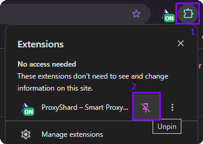
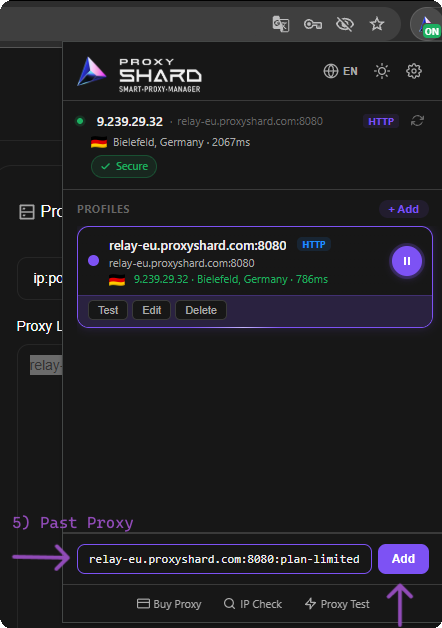
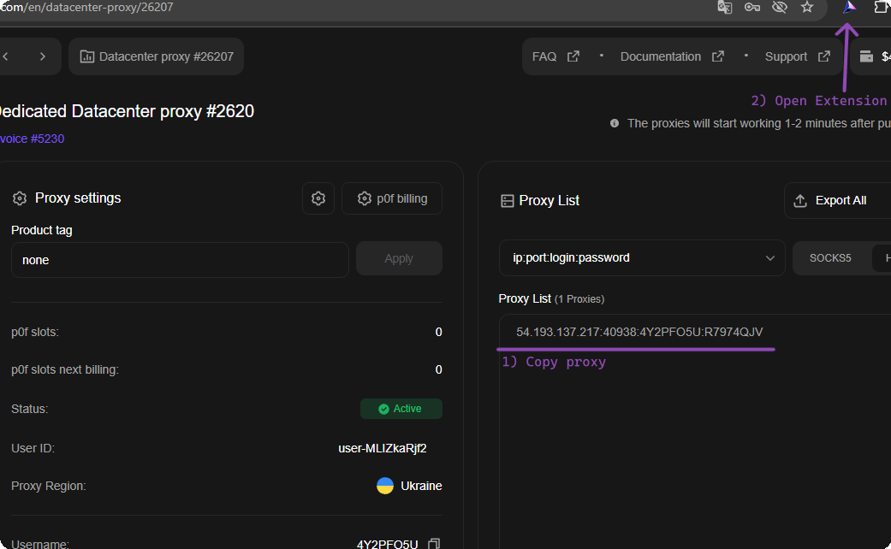
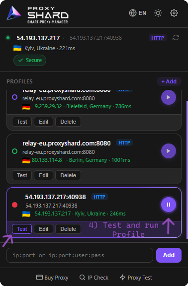
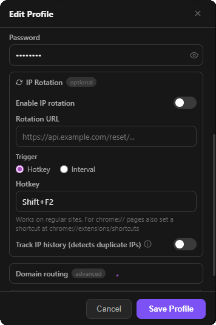
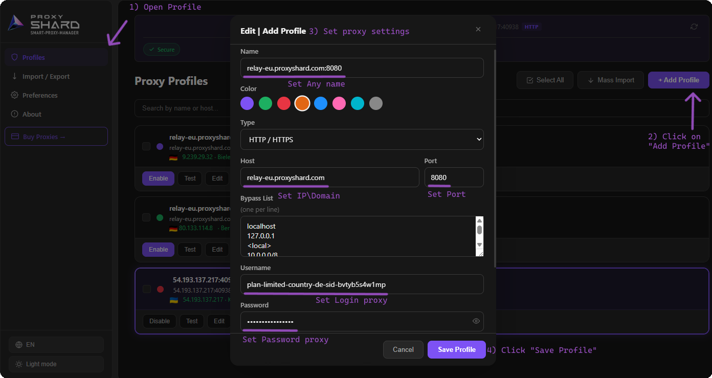

# ProxyShard Extension

<mark style="color:purple;">**ProxyShard – Smart Proxy Manager**</mark> 是我们的官方浏览器扩展程序，适用于 <mark style="color:purple;">Chrome</mark>、<mark style="color:purple;">Mozilla Firefox</mark> 以及其他基于 Chromium 内核的浏览器（<mark style="color:purple;">Edge</mark>、<mark style="color:purple;">Opera</mark>、<mark style="color:purple;">Brave</mark>、<mark style="color:purple;">Yandex</mark> 等），让您只需点击几下即可直接在浏览器中添加、切换和测试代理，无需任何第三方软件。

#### 扩展程序的功能：

* 保存无限数量的代理配置文件
* 在所有受支持的浏览器中支持 <mark style="color:purple;">HTTP / HTTPS</mark> 连接
* 在 Mozilla Firefox 版本中支持 <mark style="color:purple;">SOCKS5</mark>
* 一键测试每个配置文件（延迟、国家/地区、IP）
* <mark style="color:purple;">**按计时器或热键进行 IP 轮换**</mark>，适用于移动代理
* 旁路列表与高级域名路由
* 已本地化为**英语、俄语、乌克兰语和中文**

<figure><figcaption>
ProxyShard 扩展程序界面
</figcaption></figure>

## 安装扩展程序

该扩展程序可在官方 **Chrome Web Store** 和 **Firefox Add-ons** 中获取。Chrome Web Store 版本也可以毫无问题地安装到 Edge、Opera、Brave 以及其他基于 Chromium 的浏览器中。

### Chrome、Edge、Opera、Brave、Yandex 及其他 Chromium 浏览器

{% embed url="https://chromewebstore.google.com/detail/proxyshard-%E2%80%93-smart-proxy/ohlcikccaeapbfpmejhckfjjddkcflbe" %}

### Mozilla Firefox



安装完成后，打开扩展菜单（地址栏右侧的拼图图标），点击 ProxyShard 名称旁的「图钉」图标，将其**固定**到工具栏以便快速访问。

<figure><figcaption>
1) 打开扩展菜单 2) 固定 ProxyShard
</figcaption></figure>


**Chromium 浏览器中 SOCKS5 的限制**

Google Chrome（以及其他基于 Chromium 的浏览器）默认不支持通过用户名/密码对 SOCKS5 代理进行身份验证。对于基于 **Manifest V3** 的扩展程序，该限制依然存在。

通过扩展程序使用 SOCKS5 只能：

* **不带凭据**（匿名代理）使用，或
* **通过 IP 白名单**进行绑定

对于需要身份验证的代理，请使用 <mark style="color:purple;">**HTTP / HTTPS**</mark> 协议，该协议完全受支持。



**Mozilla Firefox 中的 SOCKS5**

ProxyShard Extension 的 Mozilla Firefox 版本可通过扩展程序使用 SOCKS5，因此您可以在 Firefox 中直接使用 SOCKS5 配置文件。


## 配置住宅代理

1. 在 [**Residential proxy**](https://dashboard.proxyshard.com/en/residential-main) 页面打开您的订单，设置代理参数（国家、地区、协议、TTL、端口等）。
2. 点击 <mark style="color:purple;">**Generate proxy**</mark>，生成的代理将显示在右侧的 <mark style="color:purple;">Proxy List</mark> 区块中。
3. 使用 <mark style="color:purple;">**Copy all**</mark> 按钮复制连接字符串。
4. 打开 ProxyShard 扩展程序（地址栏右侧已固定的图标）。

<figure><figcaption>
步骤 1-4：在控制面板配置并复制代理
</figcaption></figure>

5. 在扩展程序底部的输入框中，按 `ip:port:login:password` 格式**粘贴已复制的字符串**，然后点击 <mark style="color:purple;">**Add**</mark>。

<figure><figcaption>
步骤 5：粘贴代理并添加配置文件
</figcaption></figure>

6. 配置文件将出现在列表中。点击 <mark style="color:purple;">**Test**</mark> 验证可用性，然后点击 <mark style="color:purple;">**Play**</mark> 按钮以激活代理。

<figure><figcaption>
步骤 6：测试并启动配置文件
</figcaption></figure>

## 配置 Datacenter / ISP 代理

1. 在控制面板打开您的 <mark style="color:purple;">Datacenter</mark> 或 <mark style="color:purple;">ISP proxy</mark> 订单，从 <mark style="color:purple;">Proxy List</mark> 区块**复制**连接字符串。
2. 打开已固定的 **ProxyShard** 扩展程序。

<figure><figcaption>
步骤 1-2：从订单复制代理并打开扩展程序
</figcaption></figure>

3. 在扩展程序底部的输入框中**粘贴代理**（`ip:port:login:password`），然后点击 <mark style="color:purple;">**Add**</mark>。

<figure><figcaption>
步骤 3：将代理粘贴到扩展程序
</figcaption></figure>

4. 点击 <mark style="color:purple;">**Test**</mark> 验证，然后通过 <mark style="color:purple;">**Play**</mark> 按钮激活配置文件。

<figure><figcaption>
步骤 4：测试并启动配置文件
</figcaption></figure>


**移动代理：按计时器或热键进行 IP 轮换**

编辑配置文件时，可以使用 <mark style="color:purple;">**IP Rotation**</mark> 区块，该功能对<mark style="color:purple;">移动代理</mark>特别有用：

* **Rotation URL** - 粘贴来自您移动代理订单的 IP 切换链接，扩展程序将自动调用它。
* **Trigger: Interval** - 按设定的时间间隔进行轮换。
* **Trigger: Hotkey** - 设置组合键（例如 `Shift+F2`）来即时切换 IP。
* **Track IP history** - 重复检测功能：如果在会话期间出现相同的 IP 地址，扩展程序将通知您。



## 手动添加配置文件

如果您希望手动创建配置文件，而不是粘贴现成的字符串，请使用完整的 <mark style="color:purple;">**+ Add Profile**</mark> 表单。

1. 在扩展程序中打开 <mark style="color:purple;">**Profiles**</mark> 部分（通过齿轮 / 设置图标）。
2. 点击右上角的 <mark style="color:purple;">**+ Add Profile**</mark> 按钮。
3. 填写配置文件参数：
   * <mark style="color:purple;">**Name**</mark> - 任意配置文件名称
   * <mark style="color:purple;">**Color**</mark> - 用于方便识别的颜色标签
   * <mark style="color:purple;">**Type**</mark> - 协议（推荐 `HTTP / HTTPS`）
   * <mark style="color:purple;">**Host**</mark> 与 <mark style="color:purple;">**Port**</mark> - 代理服务器地址和端口
   * <mark style="color:purple;">**Bypass List**</mark> - 需要**直接**绕过代理的 IP / 域名列表（每行一条）
   * <mark style="color:purple;">**Username**</mark> / <mark style="color:purple;">**Password**</mark> - 身份验证信息
4. 点击 <mark style="color:purple;">**Save Profile**</mark>。

<figure><figcaption>
完整的配置文件创建表单
</figcaption></figure>


**完成！** ProxyShard 扩展程序已完全配置并可立即使用。您可以在任何受支持的浏览器中一键切换代理。

