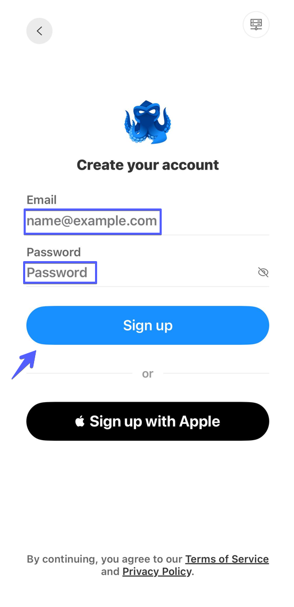

# iOS 和 Android 版 Octo Browser


代理仅在已启动的 Octo Browser 配置文件内生效。设备上的其他应用仍使用常规互联网连接。


## 安装 Octo Browser

从 App Store 或 Google Play 下载 Octo Browser。





## 注册和登录

使用电子邮件创建账户，或点击 **Sign up with Apple**。

<figure><figcaption></figcaption></figure>

注册完成后，使用相同的方式登录。

## 创建使用代理的配置文件

在 **Profiles** 页面点击 **Create Profile**。

<figure><figcaption></figcaption></figure>

在新配置文件的设置中点击 **Set a proxy**。

<figure><figcaption></figcaption></figure>

从相应的 ProxyShard 订单中复制完整的代理连接字符串，并将其粘贴到 **Proxy** 字段。Octo Browser 支持 HTTP、HTTPS 和 SOCKS5 代理。

点击 **Check proxy**。检查成功后，应用会显示连接的 IP 地址、位置和时区。然后点击 **Done**。

<figure><figcaption></figcaption></figure>

## 启动配置文件

点击 **Create & Start**，保存并立即启动配置文件。

<figure><figcaption></figcaption></figure>

设置完成。此 Octo Browser 配置文件的流量将通过所添加的代理传输。
