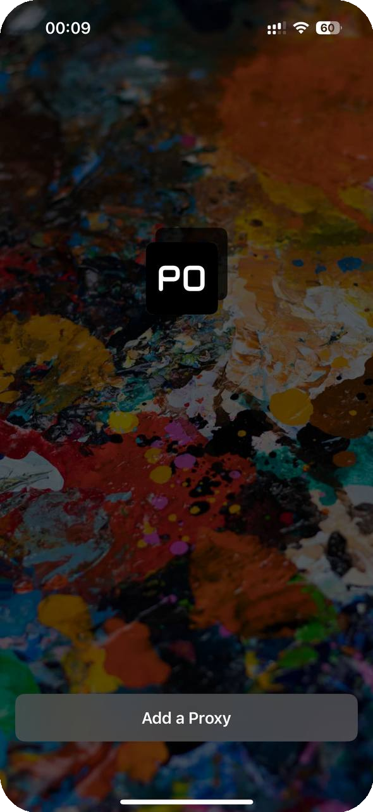
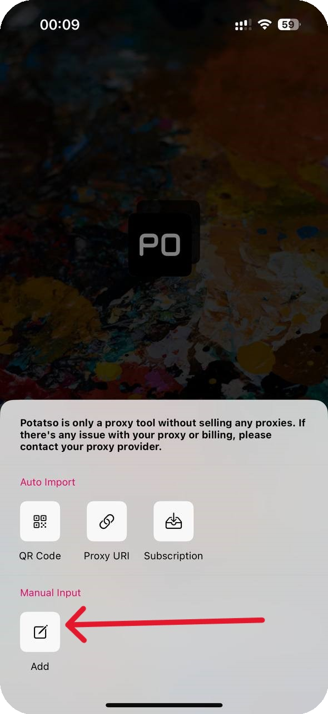

# Potatso

## 安装 Potatso

下载应用程序。



## Potatso 设置

然后打开应用程序并添加代理。

<figure><figcaption></figcaption></figure>

创建新配置。

<figure><figcaption></figcaption></figure>

## 配置文件设置

输入订单中的代理并选择连接类型。

<figure><figcaption></figcaption></figure>


**您可以在[设置指南](../getting-started.md)部分找到代理设置示例**


保存设置并启动程序。

<figure><figcaption></figcaption></figure>

**完毕！您已通过“Potatso”应用程序完成代理设置。**\
**您现在可以开始使用我们的代理。**

