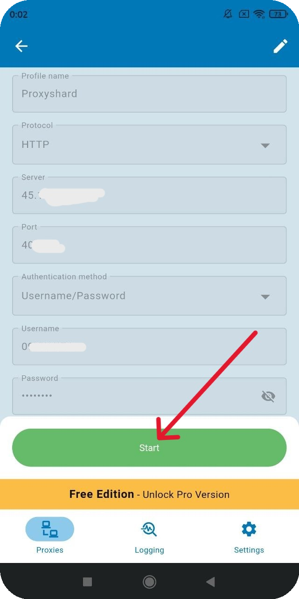

# Super Proxy

## Super Proxy设置

通过以下链接下载应用程序：



## 创建个人资料

然后打开应用程序，通过“<mark style="color:purple;">Add proxy</mark>”添加代理。

<figure><figcaption></figcaption></figure>

在相应字段中输入订单中的代理并指定连接协议类型。

<figure><figcaption></figcaption></figure>


**您可以在[设置指南](../getting-started.md)部分找到代理设置示例**


保存设置并启动程序。

<figure><figcaption></figcaption></figure>

**完毕！您已通过“超级代理”应用程序完成代理设置。**\
**您现在可以开始使用我们的代理。**

