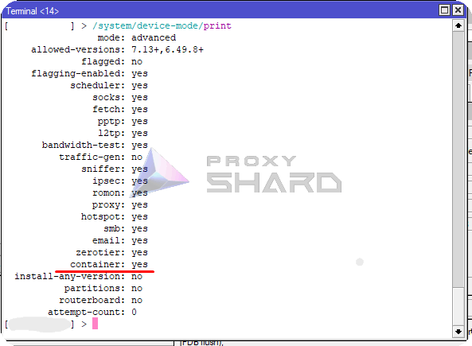
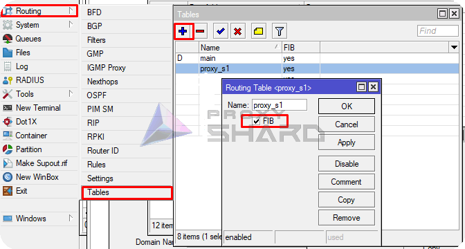
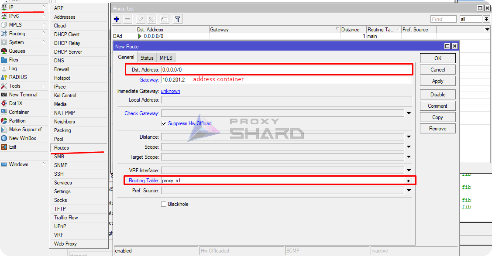
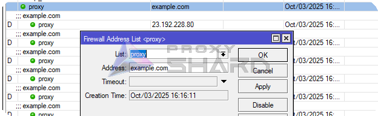
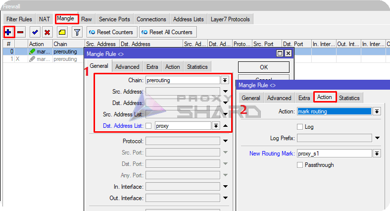

# MikroTik 代理

## 系统要求

要在 <mark style="color:blue;">MikroTik</mark> 路由器上使用代理，请考虑以下硬件要求：\
\
1\) <mark style="color:$danger;">RouterOS版本7或更高版本</mark>，因为需要容器化支持\
\
2\) <mark style="color:$danger;">128 MB 以上 RAM</mark>\ 的路由器型号
\
3\) 路由器必须具有 [**arm64**、**arm** 或 **x86**](https://mikrotik.com/products/matrix) CPU 架构，因为仅在这些架构上支持虚拟化。通过链接了解更多信息：

[https://help.mikrotik.com/docs/spaces/ROS/pages/84901929/Container](https://help.mikrotik.com/docs/spaces/ROS/pages/84901929/Container)


目前市场上可用的合适路由器示例： **hAP ax2、hAP ax3、Chateau PRO ax、RB5009、L009UiGS**



#### 警告：

您需要物理访问 RouterOS 设备才能启用对容器功能的支持，默认情况下禁用；

* 一旦启用容器功能，就可以远程添加/配置/启动/停止/删除容器！
* 如果您的 RouterOS 设备遭到入侵，容器可用于轻松地在您的 RouterOS 设备中并通过网络安装恶意软件；
* 您的 RouterOS 设备与您在容器中运行的任何设备一样安全；
* 如果你运行容器，则没有任何类型的安全保证；
* 在 RouterOS 设备上运行第 3 方容器映像可能会打开安全漏洞/攻击向量/攻击面；
* 懂得如何构建漏洞的专家将能够越狱/提升到 root 权限；

[https://help.mikrotik.com/docs/spaces/ROS/pages/84901929/Container#Container-Disclaimer](https://help.mikrotik.com/docs/spaces/ROS/pages/84901929/Container#Container-Disclaimer)


## **准备路由器**

1. **安装所需的包**

打开控制台并输入以下命令来设置更新通道。

```sh
/system package update set channel=stable
```

然后打印包裹清单。

```sh
/system package update check-for-updates
```

启用“容器”包并重新启动路由器。

```sh
/system/package enable container
```

\
或者从 MikroTik 网站下载 <mark style="color:$danger;">**ROS**</mark> 版本和 <mark style="color:$danger;">**架构**</mark> 的“额外包”后，通过 Winbox 手动安装“容器”包（[https://mikrotik.com/download]（https://mikrotik.com/download））。

<figure><figcaption></figcaption></figure>

打开下载的存档，将包复制到文件列表，然后重新启动设备。

<figure><figcaption></figcaption></figure>

重新启动后，“Container”包应该出现。

<figure><figcaption></figcaption></figure>

2. **启用容器化支持**

要在路由器上激活容器化，请在终端中输入以下命令：

```sh
/system/device-mode/update container=yes
```

然后在5分钟内重新启动路由器。重启后，容器创建即可使用 .png>)

您还可以通过控制台检查：

```shell
/system/device-mode/print
```

“容器”应该是“是”

<figure><figcaption></figcaption></figure>

## **安装和配置容器**

**创建VETH接口**

为未来的容器创建虚拟接口：

```bash
/interface veth add address=10.0.201.2/24 dhcp=no gateway=10.0.201.1 gateway6="" mac-address=6D:F3:B2:85:44:45 name=veth1
```

在哪里：\
_**地址**_ - 您要分配给容器的地址\
_**gateway**_ - 您的网桥的地址（主网络网关）

<figure><figcaption><p>Viewing the bridge address</p></figcaption></figure>

为了清楚起见，我们将在内部网络内执行所有操作，而不将容器网络与家庭网络分开。

2. **将接口添加到活动网桥**

将创建的接口添加到网桥中。

```sh
/interface bridge port
 add bridge=bridge1 interface=veth1
```

<figure><figcaption></figcaption></figure>

3. **配置虚拟化并添加容器**

在此示例中，我们将使用来自 [wiktorbgu](https://github.com/wiktorbgu) 的基于 [hev-socks5-tunnel](https://github.com/heiher/hev-socks5-tunnel) 的 Docker 映像。

[链接](https://hub.docker.com/r/wiktorbgu/hev-socks5-tunnel-mikrotik) 到 Docker 镜像

**为容器创建变量**

对于容器，您需要创建包含代理连接参数的变量。为此，请在 MikroTik 控制台中添加以下变量：

```bash
/container envs 
add key=SOCKS5_ADDR list=proxy1 value=ip/domain_proxy 
add key=SOCKS5_INTERFACE list=proxy1 value=xray_eth 
add key=SOCKS5_PASSWORD list=proxy1 value=password_proxy 
add key=SOCKS5_PORT list=proxy1 value=port_proxy 
add key=SOCKS5_UDP_MODE list=proxy1 value=udp 
add key=SOCKS5_USERNAME list=proxy1 value=username_proxy
```

<figure><figcaption></figcaption></figure>

必须根据购买订单中的数据填写这些字段。


**您可以在** [**设置指南**](getting-started.md) **中查看代理设置示例。**



请注意，测试连接是通过 SOCKS5 进行的！要查找 SOCKS 连接端口，请单击订单内的_**显示袜子5**_。


## **添加容器**

添加registry-url 和用于下载图像的临时文件夹。

```bash
/container config
set registry-url=https://registry-1.docker.io tmpdir=/tmp
```

然后创建容器，指定“工作目录”、“接口”和其他参数。

```bash
/container
add check-certificate=no envlists=proxy1 interface=veth1 name=hev-socks5-tunnel-mikrotikS1 remote-image=wiktorbgu/hev-socks5-tunnel-mikrotik root-dir=hev-datas1 workdir=/ start-on-boot=yes
```

<figure><figcaption></figcaption></figure>

启动容器。

```bash
/container/start hev-socks5-tunnel-mikrotikS1
```

.png>)

在此阶段，还值得检查与容器的连接性。

```bash
ping 10.0.201.2
```

## 自定义路由设置

1. **添加路线**

要为各个网络设备或特定资源的流量配置精确路由，您需要创建单独的 FIB。

```bash
/routing/table/add name=proxy_s1 fib
```

<figure><figcaption></figcaption></figure>

将默认路由添加到容器以供将来的规则使用。

```bash
/ip route
add disabled=no dst-address=0.0.0.0/0 gateway=10.0.201.2 routing-table=
proxy_s1 suppress-hw-offload=yes
```

<figure><figcaption></figcaption></figure>

2. **添加规则以将流量重定向到特定资源**

要通过代理将流量重定向到所需资源，请在“ip/firewall/address list”中创建静态地址列表。

假设我们想通过代理打开 example.com。创建具有任意名称的列表并指定资源 IP 地址或域。

```bash
/ip firewall address-list
add address=example.com list=proxy
```

<figure><figcaption></figcaption></figure>

接下来，创建一个 Mangle 规则，将所有流量标记到指定资源，并在“操作”中指定上一步中创建的新路由路径。

```bash
/ip firewall mangle
add action=mark-routing chain=prerouting dst-address-list=proxy new-routing-mark=proxy_s1 passthrough=no
```

<figure><figcaption></figcaption></figure>

使用相同的逻辑，您可以添加其他资源，例如 YouTube：

<details>

<summary> YouTube 列表</summary>

添加地址=142.250.184.0/24 评论=Youtube 列表=代理\
添加地址=107.0.0.0/8 评论=Youtube 列表=代理\
添加地址=142.250.185.0/24 评论=Youtube 列表=代理\
添加地址=3.0.0.0/8 评论=Youtube 列表=代理\
添加地址=216.58.212.0/24 评论=Youtube 列表=代理\
添加地址=93.158.134.0/24 评论=Youtube 列表=代理\
添加地址=74.125.71.0/24 评论=Youtube 列表=代理\
添加地址=216.58.206.0/24 评论=Youtube 列表=代理\
添加地址=142.250.186.0/24 评论=Youtube 列表=代理\
添加地址=42.192.32.0/24 评论=Youtube 列表=代理\
添加地址=74.125.206.0/24 评论=Youtube 列表=代理\
添加地址=173.194.0.0/16 评论=Youtube 列表=代理\
添加地址=172.217.0.0/16 评论=Youtube 列表=代理\
添加地址=142.250.0.0/16 评论=Youtube 列表=代理\
添加地址=74.125.0.0/16 评论=Youtube 列表=代理\
添加地址=216.58.0.0/16 评论=Youtube 列表=代理\
添加地址=74.0.0.0/8 评论=Youtube 列表=代理\
添加地址=3.76.0.0/16 评论=Youtube 列表=代理\
添加地址=3.78.0.0/16 评论=Youtube 列表=代理\
添加地址=216.239.0.0/16 评论=Youtube 列表=代理\
添加地址=64.233.0.0/16 评论=Youtube 列表=代理\
添加地址=8.222.0.0/16 评论=Youtube 列表=代理\
添加地址=107.155.0.0/16 评论=Youtube 列表=代理\
添加地址=35.207.0.0/16 评论=Youtube 列表=代理\
添加地址=3.66.0.0/16 评论=Youtube 列表=代理\
添加地址=18.140.0.0/16 评论=Youtube 列表=代理\
添加地址=23.2.0.0/16 评论=Youtube 列表=代理\
添加地址=99.81.0.0/16 评论=Youtube 列表=代理\
添加地址=54.0.0.0/16 评论=Youtube 列表=代理\
添加地址=77.241.0.0/16 评论=Youtube 列表=代理\
添加地址=108.177.0.0/16 评论=Youtube 列表=代理\
添加地址=184.86.0.0/16 评论=Youtube 列表=代理\
添加地址=52.0.0.0/16 评论=Youtube 列表=代理\
添加地址=63.35.0.0/16 评论=Youtube 列表=代理\
添加地址=101.34.0.0/16 评论=Youtube 列表=代理\
添加地址=34.252.0.0/16 评论=Youtube 列表=代理\
添加地址=45.57.0.0/16 评论=Youtube 列表=代理\
添加地址=169.254.0.0/16 评论=Youtube 列表=代理\
添加地址=34.0.0.0/16 评论=Youtube 列表=代理\
添加地址=184.0.0.0/16 评论=Youtube 列表=代理\
添加地址=87.0.0.0/16 评论=Youtube 列表=代理\
添加地址=213.59.0.0/16 评论=Youtube 列表=代理\
添加地址=157.240.247.174 评论=Instagram 列表=代理\
添加地址=46.53.178.107 评论=Instagram 列表=代理\
添加地址=179.60.195.174 评论=Instagram 列表=代理\
添加地址=157.240.205.174 评论=Instagram 列表=代理\
添加地址=31.13.24.0/21 评论=Instagram 列表=代理\
添加地址=31.13.64.0/18 评论=Instagram 列表=代理\
添加地址=45.64.40.0/22 评论=Instagram 列表=代理\
添加地址=66.220.144.0/20 评论=Instagram 列表=代理\
添加地址=69.63.176.0/20 评论=Instagram 列表=代理\
添加地址=69.171.224.0/19 评论=Instagram 列表=代理\
添加地址=74.119.76.0/22 评论=Instagram 列表=代理\
添加地址=103.4.96.0/22 评论=Instagram 列表=代理\
添加地址=129.134.0.0/16 评论=Instagram 列表=代理\
添加地址=157.240.0.0/16 评论=Instagram 列表=代理\
添加地址=173.252.64.0/18 评论=Instagram 列表=代理\
添加地址=179.60.192.0/22 评论=Instagram 列表=代理\
添加地址=185.60.216.0/22 评论=Instagram 列表=代理\
添加地址=204.15.20.0/22 评论=Instagram 列表=代理\
添加地址=157.240.200.63 评论=Instagram 列表=代理\
添加地址=185.60.219.63 评论=Instagram 列表=代理\
添加地址=129.134.31.12 评论=Instagram 列表=代理\
添加地址=66.81.203.132 评论=Instagram 列表=代理\
添加地址=185.89.218.12 评论=Instagram 列表=代理\
添加地址=31.13.66.63 评论=Instagram 列表=代理\
添加地址=84.15.65.162 评论=Instagram 列表=代理\
添加地址=68.66.224.28 评论=Instagram 列表=代理\
添加地址=157.240.253.63 评论=Instagram 列表=代理\
添加地址=83.174.11.224 评论=Instagram 列表=代理\
添加地址=157.240.9.52 评论=Instagram 列表=代理\
添加地址=157.240.252.174 评论=Instagram 列表=代理\
添加地址=157.240.195.63 评论=Instagram 列表=代理\
添加地址=31.13.71.52 评论=Instagram 列表=代理\
添加地址=57.144.110.192 评论=Instagram 列表=代理\
添加地址=157.240.252.17 评论=Instagram 列表=代理\
添加地址=84.15.66.97 评论=Instagram 列表=代理\
添加地址=217.168.6.33 评论=Instagram 列表=代理\
添加地址=31.13.83.52 评论=Instagram 列表=代理\
添加地址=157.240.241.63 评论=Instagram 列表=代理\
添加地址=129.134.30.12 评论=Instagram 列表=代理\
添加地址=185.89.219.12 评论=Instagram 列表=代理\
添加地址=157.240.252.10 评论=Instagram 列表=代理\
添加地址=157.240.201.63 评论=Instagram 列表=代理\
添加地址=66.81.203.197 评论=Instagram 列表=代理\
添加地址=179.60.195.52 评论=Instagram 列表=代理\
添加地址=66.81.203.7 评论=Instagram 列表=代理\
添加地址=216.40.34.41 评论=Instagram 列表=代理\
添加地址=157.240.202.63 评论=Instagram 列表=代理\
添加地址=157.240.229.63 评论=Instagram 列表=代理\
添加地址=157.240.252.63 评论=Instagram 列表=代理\
添加地址=31.13.72.53 评论=Instagram 列表=代理\
添加地址=124.108.16.224 评论=Instagram 列表=代理\
添加地址=157.240.205.63 评论=Instagram 列表=代理\
添加地址=92.46.37.96 评论=Instagram 列表=代理\
添加地址=157.240.247.63 评论=Instagram 列表=代理\
添加地址=157.240.234.63 评论=Instagram 列表=代理\
添加地址=157.240.235.63 评论=Instagram 列表=代理\
添加地址=87.245.208.97 评论=Instagram 列表=代理\
添加地址=216.58.192.0/19 评论=Instagram 列表=代理\
添加地址=209.85.128.0/17 评论=Instagram 列表=代理\
添加地址=198.105.240.0/20 评论=Instagram 列表=代理\
添加地址=142.250.0.0/15 评论=Instagram 列表=代理\
添加地址=108.177.0.0/17 评论=Instagram 列表=代理\
添加地址=87.245.197.140 评论=Instagram 列表=代理\
添加地址=64.233.160.0/19 评论=Instagram 列表=代理\
添加地址=157.240.0.1 评论=Instagram 列表=代理\
添加地址=157.240.238.63 评论=Instagram 列表=代理\
添加地址=157.240.238.174 评论=Instagram 列表=代理\
添加地址=157.240.0.63 评论=Instagram 列表=代理\
添加地址=157.240.224.63 评论=Instagram 列表=代理\
添加地址=157.240.224.174 评论=Instagram 列表=代理\
添加地址=157.240.251.36 评论=Instagram 列表=代理\
添加地址=157.240.253.12 评论=Instagram 列表=代理\
添加地址=157.240.253.35 评论=Instagram 列表=代理\
添加地址=157.240.238.13 评论=Instagram 列表=代理\
添加地址=157.240.238.56 评论=Instagram 列表=代理\
添加地址=157.240.238.175 评论=Instagram 列表=代理\
添加地址=57.144.112.141 评论=Instagram 列表=代理\
添加地址=157.240.251.60 评论=Instagram 列表=代理\
添加地址=157.240.251.128 评论=Instagram 列表=代理\
添加地址=157.240.238.5 评论=Instagram 列表=代理\
添加地址=157.240.253.13 评论=Instagram 列表=代理\
添加地址=157.240.253.5 评论=Instagram 列表=代理\
添加地址=157.240.238.2 评论=Instagram 列表=代理\
添加地址=157.240.238.37 评论=Instagram 列表=代理\
添加地址=157.240.251.5 评论=Instagram 列表=代理\
添加地址=157.240.251.34 评论=Instagram 列表=代理\
添加地址=57.144.112.1 评论=Instagram 列表=代理\
添加地址=157.240.238.54 评论=Instagram 列表=代理\
添加地址=129.134.26.123 评论=Instagram 列表=代理\
添加地址=157.240.252.3 评论=Instagram 列表=代理\
添加地址=31.13.84.4 评论=Instagram 列表=代理\
添加地址=157.240.224.12 评论=Instagram 列表=代理\
添加地址=157.240.238.4 评论=Instagram 列表=代理\
添加地址=157.240.0.13 评论=Instagram 列表=代理\
添加地址=3.33.139.32 评论=Instagram 列表=代理\
添加地址=157.240.0.35 评论=Instagram 列表=代理\
添加地址=157.240.238.14 评论=Instagram 列表=代理\
添加地址=157.240.238.60 评论=Instagram 列表=代理\
添加地址=57.144.112.145 评论=Instagram 列表=代理\
添加地址=157.240.251.35 评论=Instagram 列表=代理\
添加地址=157.240.0.21 评论=Instagram 列表=代理\
添加地址=54.155.178.5 评论=Netflix 列表=代理\
添加地址=3.251.50.149 评论=Netflix 列表=代理\
添加地址=54.74.73.31 评论=Netflix 列表=代理\
添加地址=52.1.147.205 评论=Netflix 列表=代理\
添加地址=107.20.175.192 评论=Netflix 列表=代理\
添加地址=50.17.247.9 评论=Netflix 列表=代理\
添加地址=204.236.236.127 评论=Netflix 列表=代理\
添加地址=52.6.46.142 评论=Netflix 列表=代理\
添加地址=18.236.7.30 评论=Netflix 列表=代理\
添加地址=52.4.175.111 评论=Netflix 列表=代理\
添加地址=100.82.106.206 评论=Netflix 列表=代理\
添加地址=100.85.59.120 评论=Netflix 列表=代理\
添加地址=46.137.171.215 评论=Netflix 列表=代理\
添加地址=34.218.19.240 评论=Netflix 列表=代理\
添加地址=44.226.113.145 评论=Netflix 列表=代理\
添加地址=52.1.119.170 评论=Netflix 列表=代理\
添加地址=52.214.181.141 评论=Netflix 列表=代理\
添加地址=207.45.72.215 评论=Netflix 列表=代理\
添加地址=100.82.180.182 评论=Netflix 列表=代理\
添加地址=54.246.79.9 评论=Netflix 列表=代理\
添加地址=52.4.38.70 评论=Netflix 列表=代理\
添加地址=52.4.225.124 评论=Netflix 列表=代理\
添加地址=52.4.240.221 评论=Netflix 列表=代理\
添加地址=52.1.173.203 评论=Netflix 列表=代理\
添加地址=52.0.16.118 评论=Netflix 列表=代理\
添加地址=52.6.3.192 评论=Netflix 列表=代理\
添加地址=34.252.74.1 评论=Netflix 列表=代理\
添加地址=52.4.145.119 评论=Netflix 列表=代理\
添加地址=52.5.181.79 评论=Netflix 列表=代理\
添加地址=54.170.196.176 评论=Netflix 列表=代理\
添加地址=52.31.48.193 评论=Netflix 列表=代理\
添加地址=23.246.0.0/18 评论=Netflix 列表=代理\
添加地址=37.77.184.0/21 评论=Netflix 列表=代理\
添加地址=45.57.0.0/17 评论=Netflix 列表=代理\
添加地址=64.120.128.0/17 评论=Netflix 列表=代理\
添加地址=66.197.128.0/17 评论=Netflix 列表=代理\
添加地址=108.175.32.0/20 评论=Netflix 列表=代理\
添加地址=185.2.220.0/22 评论=Netflix 列表=代理\
添加地址=185.9.188.0/22 评论=Netflix 列表=代理\
添加地址=192.173.64.0/18 评论=Netflix 列表=代理\
添加地址=198.38.96.0/19 评论=Netflix 列表=代理\
添加地址=198.45.48.0/20 评论=Netflix 列表=代理\
添加地址=198.45.56.0/21 评论=Netflix 列表=代理\
添加地址=208.75.76.0/22 评论=Netflix 列表=代理\
添加地址=209.237.204.128 评论=Twitter 列表=代理\
添加地址=3.64.163.50 评论=Twitter 列表=代理\
添加地址=104.244.42.2 评论=Twitter 列表=代理\
添加地址=209.237.197.128 评论=Twitter 列表=代理\
添加地址=188.40.44.177 评论=Twitter 列表=代理\
添加地址=34.254.1.203 评论=Twitter 列表=代理\
添加地址=108.186.36.25 评论=Twitter 列表=代理\
添加地址=69.195.160.128 评论=Twitter 列表=代理\
添加地址=69.195.176.128 评论=Twitter 列表=代理\
添加地址=23.1.99.237 评论=Twitter 列表=代理\
添加地址=93.184.220.70 评论=Twitter 列表=代理\
添加地址=34.251.129.198 评论=Twitter 列表=代理\
添加地址=209.237.196.128 评论=Twitter 列表=代理\
添加地址=172.67.70.184 评论=Twitter 列表=代理\
添加地址=104.26.0.84 评论=Twitter 列表=代理\
添加地址=104.244.42.84 评论=Twitter 列表=代理\
添加地址=151.101.0.159 评论=Twitter 列表=代理\
添加地址=209.237.192.128 评论=Twitter 列表=代理\
添加地址=104.26.1.84 评论=Twitter 列表=代理\
添加地址=199.232.188.159 评论=Twitter 列表=代理\
添加地址=3.248.100.228 评论=Twitter 列表=代理\
添加地址=104.244.45.3 评论=Twitter 列表=代理\
添加地址=104.244.42.193 评论=Twitter 列表=代理\
添加地址=104.244.42.129 评论=Twitter 列表=代理\
添加地址=69.195.177.128 评论=Twitter 列表=代理\
添加地址=151.101.64.159 评论=Twitter 列表=代理\
添加地址=209.237.194.128 评论=Twitter 列表=代理\
添加地址=104.26.5.149 评论=Twitter 列表=代理\
添加地址=104.244.42.196 评论=Twitter 列表=代理\
添加地址=104.244.42.194 评论=Twitter 列表=代理\
添加地址=23.1.106.237 评论=Twitter 列表=代理\
添加地址=185.199.110.153 评论=Twitter 列表=代理\
添加地址=209.237.199.128 评论=Twitter 列表=代理\
添加地址=69.195.180.128 评论=Twitter 列表=代理\
添加地址=151.101.192.159 评论=Twitter 列表=代理\
添加地址=209.237.203.128 评论=Twitter 列表=代理\
添加地址=209.237.193.128 评论=Twitter 列表=代理\
添加地址=69.195.182.128 评论=Twitter 列表=代理\
添加地址=104.244.42.67 评论=Twitter 列表=代理\
添加地址=52.30.155.196 评论=Twitter 列表=代理\
添加地址=52.214.101.56 评论=Twitter 列表=代理\
添加地址=69.195.165.128 评论=Twitter 列表=代理\
添加地址=104.244.42.148 评论=Twitter 列表=代理\
添加地址=104.244.42.195 评论=Twitter 列表=代理\
添加地址=104.244.42.66 评论=Twitter 列表=代理\
添加地址=104.244.42.1 评论=Twitter 列表=代理\
添加地址=185.199.111.153 评论=Twitter 列表=代理\
添加地址=69.195.187.128 评论=Twitter 列表=代理\
添加地址=104.244.42.130 评论=Twitter 列表=代理\
添加地址=104.244.42.3 评论=Twitter 列表=代理\
添加地址=185.199.108.153 评论=Twitter 列表=代理\
添加地址=104.244.42.4 评论=Twitter 列表=代理\
添加地址=69.195.168.128 评论=Twitter 列表=代理\
添加地址=209.237.200.128 评论=Twitter 列表=代理\
添加地址=209.237.201.128 评论=Twitter 列表=代理\
添加地址=104.244.42.68 评论=Twitter 列表=代理\
添加地址=69.195.186.128 评论=Twitter 列表=代理\
添加地址=34.243.204.245 评论=Twitter 列表=代理\
添加地址=152.199.21.141 评论=Twitter 列表=代理\
添加地址=93.184.221.165 评论=Twitter 列表=代理\
添加地址=192.229.233.25 评论=Twitter 列表=代理\
添加地址=172.67.74.16 评论=Twitter 列表=代理\
添加地址=209.237.195.128 评论=Twitter 列表=代理\
添加地址=69.195.181.128 评论=Twitter 列表=代理\
添加地址=69.195.163.128 评论=Twitter 列表=代理\
添加地址=104.244.42.72 评论=Twitter 列表=代理\
添加地址=69.195.185.128 评论=Twitter 列表=代理\
添加地址=34.242.228.15 评论=Twitter 列表=代理\
添加地址=104.26.4.149 评论=Twitter 列表=代理\
添加地址=69.195.162.128 评论=Twitter 列表=代理\
添加地址=69.195.178.128 评论=Twitter 列表=代理\
添加地址=151.101.128.159 评论=Twitter 列表=代理\
添加地址=104.244.42.131 评论=Twitter 列表=代理\
添加地址=69.195.184.128 评论=Twitter 列表=代理\
添加地址=69.195.183.128 评论=Twitter 列表=代理\
添加地址=69.195.171.128 评论=Twitter 列表=代理\
添加地址=213.230.209.101 评论=Twitter 列表=代理\
添加地址=69.195.174.128 评论=Twitter 列表=代理\
添加地址=146.75.120.158 评论=Twitter 列表=代理\
添加地址=104.244.42.65 评论=Twitter 列表=代理\
添加地址=69.195.166.128 评论=Twitter 列表=代理\
添加地址=185.199.109.153 评论=Twitter 列表=代理\
添加地址=104.244.42.212 评论=Twitter 列表=代理\
添加地址=95.173.103.16 评论=Twitter 列表=代理\
添加地址=104.244.42.132 评论=Twitter 列表=代理\
添加地址=69.195.179.128 评论=Twitter 列表=代理\
添加地址=104.244.43.131 评论=Twitter 列表=代理\
添加地址=69.195.169.128 评论=Twitter 列表=代理\
添加地址=188.114.98.224 评论=ChatGPT 列表=代理\
添加地址=18.66.147.35 评论=ChatGPT 列表=代理\
添加地址=104.18.7.192 评论=ChatGPT 列表=代理\
添加地址=188.114.99.238 评论=ChatGPT 列表=代理\
添加地址=104.18.27.221 评论=ChatGPT 列表=代理\
添加地址=104.18.30.2 评论=ChatGPT 列表=代理\
添加地址=104.18.41.241 评论=ChatGPT 列表=代理\
添加地址=188.114.98.238 评论=ChatGPT 列表=代理\
添加地址=188.114.99.235 评论=ChatGPT 列表=代理\
添加地址=188.114.98.235 评论=ChatGPT 列表=代理\
添加地址=104.18.26.221 评论=ChatGPT 列表=代理\
添加地址=104.18.33.45 评论=ChatGPT 列表=代理\
添加地址=18.66.147.69 评论=ChatGPT 列表=代理\
添加地址=104.18.7.87 评论=ChatGPT 列表=代理\
添加地址=104.18.17.170 评论=ChatGPT 列表=代理\
添加地址=104.18.7.201 评论=ChatGPT 列表=代理\
添加地址=184.105.99.79 评论=ChatGPT 列表=代理\
添加地址=18.66.147.112 评论=ChatGPT 列表=代理\
添加地址=172.64.146.15 评论=ChatGPT 列表=代理\
添加地址=142.250.186.115 评论=ChatGPT 列表=代理\
添加地址=104.18.6.192 评论=ChatGPT 列表=代理\
添加地址=104.18.6.87 评论=ChatGPT 列表=代理\
添加地址=23.35.228.138 评论=ChatGPT 列表=代理\
添加地址=18.66.147.17 评论=ChatGPT 列表=代理\
添加地址=104.18.8.73 评论=ChatGPT 列表=代理\
添加地址=13.107.246.60 评论=ChatGPT 列表=代理\
添加地址=20.118.40.5 评论=ChatGPT 列表=代理\
添加地址=104.18.9.73 评论=ChatGPT 列表=代理\
添加地址=104.18.16.170 评论=ChatGPT 列表=代理\
添加地址=172.64.154.211 评论=ChatGPT 列表=代理\
添加地址=104.18.31.2 评论=ChatGPT 列表=代理\
添加地址=104.18.6.201 评论=ChatGPT 列表=代理\
添加地址=8.8.4.0/24 评论=Youtube 列表=代理\
添加地址=8.8.8.0/24 评论=Youtube 列表=代理\
添加地址=8.34.208.0/20 评论=Youtube 列表=代理\
添加地址=8.35.192.0/20 评论=Youtube 列表=代理\
添加地址=23.236.48.0/20 评论=Youtube 列表=代理\
添加地址=23.251.128.0/19 评论=Youtube 列表=代理\
添加地址=34.0.0.0/15 评论=Youtube 列表=代理\
添加地址=34.2.0.0/16 评论=Youtube 列表=代理\
添加地址=34.3.0.0/23 评论=Youtube 列表=代理\
添加地址=34.3.3.0/24 评论=Youtube 列表=代理\
添加地址=34.3.4.0/24 评论=Youtube 列表=代理\
添加地址=34.3.8.0/21 评论=Youtube 列表=代理\
添加地址=34.3.16.0/20 评论=Youtube 列表=代理\
添加地址=34.3.32.0/19 评论=Youtube 列表=代理\
添加地址=34.3.64.0/18 评论=Youtube 列表=代理\
添加地址=34.4.0.0/14 评论=Youtube 列表=代理\
添加地址=34.8.0.0/13 评论=Youtube 列表=代理\
添加地址=34.16.0.0/12 评论=Youtube 列表=代理\
添加地址=34.32.0.0/11 评论=Youtube 列表=代理\
添加地址=34.64.0.0/10 评论=Youtube 列表=代理\
添加地址=34.128.0.0/10 评论=Youtube 列表=代理\
添加地址=35.184.0.0/13 评论=Youtube 列表=代理\
添加地址=35.192.0.0/14 评论=Youtube 列表=代理\
添加地址=35.196.0.0/15 评论=Youtube 列表=代理\
添加地址=35.198.0.0/16 评论=Youtube 列表=代理\
添加地址=35.199.0.0/17 评论=Youtube 列表=代理\
添加地址=35.199.128.0/18 评论=Youtube 列表=代理\
添加地址=35.200.0.0/13 评论=Youtube 列表=代理\
添加地址=35.208.0.0/12 评论=Youtube 列表=代理\
添加地址=35.224.0.0/12 评论=Youtube 列表=代理\
添加地址=35.240.0.0/13 评论=Youtube 列表=代理\
添加地址=57.140.192.0/18 评论=Youtube 列表=代理\
添加地址=64.15.112.0/20 评论=Youtube 列表=代理\
添加地址=66.22.228.0/23 评论=Youtube 列表=代理\
添加地址=66.102.0.0/20 评论=Youtube 列表=代理\
添加地址=66.249.64.0/19 评论=Youtube 列表=代理\
添加地址=70.32.128.0/19 评论=Youtube 列表=代理\
添加地址=72.14.192.0/18 评论=Youtube 列表=代理\
添加地址=104.154.0.0/15 评论=Youtube 列表=代理\
添加地址=104.196.0.0/14 评论=Youtube 列表=代理\
添加地址=104.237.160.0/19 评论=Youtube 列表=代理\
添加地址=107.167.160.0/19 评论=Youtube 列表=代理\
添加地址=107.178.192.0/18 评论=Youtube 列表=代理\
添加地址=108.59.80.0/20 评论=Youtube 列表=代理\
添加地址=108.170.192.0/18 评论=Youtube 列表=代理\
添加地址=130.211.0.0/16 评论=Youtube 列表=代理\
添加地址=136.22.160.0/20 评论=Youtube 列表=代理\
添加地址=136.22.176.0/21 评论=Youtube 列表=代理\
添加地址=136.22.184.0/23 评论=Youtube 列表=代理\
添加地址=136.22.186.0/24 评论=Youtube 列表=代理\
添加地址=146.148.0.0/17 评论=Youtube 列表=代理\
添加地址=152.65.208.0/22 评论=Youtube 列表=代理\
添加地址=152.65.214.0/23 评论=Youtube 列表=代理\
添加地址=152.65.218.0/23 评论=Youtube 列表=代理\
添加地址=152.65.222.0/23 评论=Youtube 列表=代理\
添加地址=152.65.224.0/19 评论=Youtube 列表=代理\
添加地址=162.120.128.0/17 评论=Youtube 列表=代理\
添加地址=162.216.148.0/22 评论=Youtube 列表=代理\
添加地址=162.222.176.0/21 评论=Youtube 列表=代理\
添加地址=172.110.32.0/21 评论=Youtube 列表=代理\
添加地址=172.253.0.0/16 评论=Youtube 列表=代理\
添加地址=173.255.112.0/20 评论=Youtube 列表=代理\
添加地址=192.158.28.0/22 评论=Youtube 列表=代理\
添加地址=192.178.0.0/15 评论=Youtube 列表=代理\
添加地址=193.186.4.0/24 评论=Youtube 列表=代理\
添加地址=199.36.154.0/23 评论=Youtube 列表=代理\
添加地址=199.36.156.0/24 评论=Youtube 列表=代理\
添加地址=199.192.112.0/22 评论=Youtube 列表=代理\
添加地址=199.223.232.0/21 评论=Youtube 列表=代理\
添加地址=207.223.160.0/20 评论=Youtube 列表=代理\
添加地址=208.65.152.0/22 评论=Youtube 列表=代理\
添加地址=208.68.108.0/22 评论=Youtube 列表=代理\
添加地址=208.81.188.0/22 评论=Youtube 列表=代理\
添加地址=208.117.224.0/19 评论=Youtube 列表=代理\
添加地址=216.73.80.0/20 评论=Youtube 列表=代理\
添加地址=216.239.32.0/19 评论=Youtube 列表=代理\
添加地址=108.156.0.0/15 评论=Youtube 列表=代理\
添加地址=52.0.0.0/8 评论=Youtube 列表=代理\
添加地址=44.0.0.0/8 评论=Youtube 列表=代理\
添加地址=13.224.0.0/12 评论=Youtube 列表=代理\
添加地址=18.66.0.0/16 评论=Youtube 列表=代理\
添加地址=3.126.0.0/16 评论=Youtube 列表=代理\
添加地址=3.164.0.0/16 评论=Youtube 列表=代理\
添加地址=3.220.0.0/16 评论=Youtube 列表=代理\
添加地址=3.251.0.0/16 评论=Youtube 列表=代理\
添加地址=3.77.0.0/16 评论=Youtube 列表=代理\
添加地址=34.208.0.0/13 评论=Youtube 列表=代理\
添加地址=34.240.0.0/13 评论=Youtube 列表=代理\
添加地址=35.160.0.0/13 评论=Youtube 列表=代理\
添加地址=35.80.0.0/13 评论=Youtube 列表=代理\
添加地址=44.192.0.0/10 评论=Youtube 列表=代理\
添加地址=44.224.0.0/12 评论=Youtube 列表=代理\
添加地址=46.137.0.0/16 评论=Youtube 列表=代理\
添加地址=52.12.0.0/15 评论=Youtube 列表=代理\
添加地址=52.16.0.0/14 评论=Youtube 列表=代理\
添加地址=52.208.0.0/13 评论=Youtube 列表=代理\
添加地址=52.30.0.0/16 评论=Youtube 列表=代理\
添加地址=52.31.0.0/16 评论=Youtube 列表=代理\
添加地址=52.36.0.0/14 评论=Youtube 列表=代理\
添加地址=52.40.0.0/14 评论=Youtube 列表=代理\
添加地址=52.58.0.0/15 评论=Youtube 列表=代理\
添加地址=54.154.0.0/16 评论=Youtube 列表=代理\
添加地址=54.186.0.0/15 评论=Youtube 列表=代理\
添加地址=54.228.0.0/15 评论=Youtube 列表=代理\
添加地址=54.246.0.0/16 评论=Youtube 列表=代理\
添加地址=54.74.0.0/16 评论=Youtube 列表=代理\
添加地址=54.76.0.0/15 评论=Youtube 列表=代理\
添加地址=194.190.76.0/23 评论=Youtube 列表=代理\
添加地址=194.90.196.0/23 评论=Youtube 列表=代理\
添加地址=212.143.192.0/19 评论=Youtube 列表=代理\
添加地址=194.90.0.0/16 评论=Youtube 列表=代理\
添加地址=46.134.192.0/18 评论=Youtube 列表=代理\
添加地址=255.255.255.255 评论=Youtube 列表=代理\
添加地址=104.16.0.0/12 评论=Youtube 列表=代理\
添加地址=104.17.0.0/20 评论=Youtube 列表=代理\
添加地址=172.64.0.0/13 评论=Youtube 列表=代理\
添加地址=188.114.96.0/20 评论=Youtube 列表=代理\
添加地址=80.67.32.0/19 评论=Youtube 列表=代理\
添加地址=185.199.108.0/22 评论=Youtube 列表=代理\
添加地址=224.0.0.0/4 评论=Youtube 列表=代理\
添加地址=239.0.0.0/8 评论=Youtube 列表=代理\
添加地址=51.89.0.0/16 评论=Youtube 列表=代理\
添加地址=178.154.128.0/17 评论=Youtube 列表=代理\
添加地址=5.255.248.0/21 评论=Youtube 列表=代理\
添加地址=87.250.224.0/19 评论=Youtube 列表=代理

</details>


请注意，并非所有资源都可以通过域完全解析所有地址，如 example.com 示例中所示。因此，您需要指定静态 IPv4 地址的完整列表，如 YouTube 示例中所示。否则，部分网站/资源流量将无法通过代理或可能无法正常工作。对于其他资源，您可以在线搜索静态地址列表。


3. **添加规则以重定向来自设备或网络的所有流量**

要重定向特定设备或整个网络，请创建明确指定源的 Mangle 规则。\
\
假设网络中有一个地址为10.0.201.244的设备，我们希望它的流量通过代理。创建以下规则：

```bash
/ip firewall mangle
add action=mark-routing chain=prerouting src-address=10.0.201.244 new-routing-mark=proxy_s1 passthrough=no
```

作为 src-address，您可以指定整个子网或单个主机，例如 src-address=192.168.0.0/24。这样，来自指定地址/网络的所有流量将仅通过代理。

#### 完毕！您现在可以在路由器上使用代理，同时灵活管理来自网络上设备的流量。


