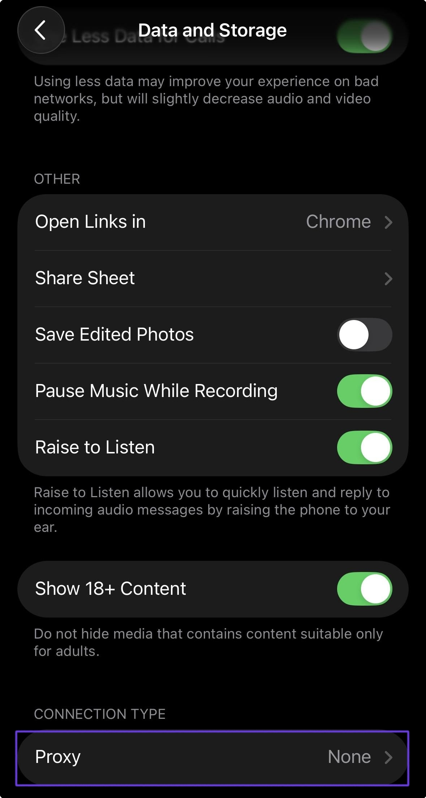

# Telegram

### 桌面版 Telegram 的代理设置

要在 <mark style="color:purple;">Telegram</mark> 中设置代理，请转至“设置”。

<figure><figcaption></figcaption></figure>

然后打开“高级”设置。

<figure><figcaption></figcaption></figure>

选择“TCP”连接类型。

<figure><figcaption></figcaption></figure>

接下来，指定代理连接。

选择适合您的连接协议。默认使用 HTTP。


**您可以在[设置指南](getting-started.md)部分找到代理设置示例**


<figure><figcaption></figcaption></figure>

然后检查连接并保存。

<figure><figcaption></figcaption></figure>

**完毕！您现在可以通过我们的代理使用 Telegram。**

### 移动版 Telegram 的代理设置

要在手机上设置代理，请打开设置并选择“数据和存储”。

<figure><figcaption></figcaption></figure>

然后选择“代理”。

<figure><figcaption></figcaption></figure>

选择 SOCKS5 协议并输入代理连接详细信息。

<figure><figcaption></figcaption></figure>

确保保存设置，然后就可以在_Telegram._中使用代理了。

