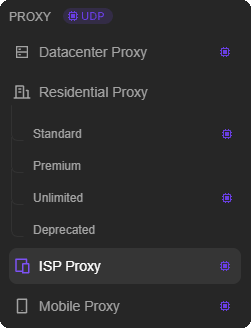

# 购买和续订代理


要购买订单，您的余额中必须有[资金](../top-up-balance.md)。


## **购买和管理订单的示例**

要购买订单，请选择您感兴趣的任何产品：

<figure><figcaption></figcaption></figure>

#### [**数据中心代理示例**](buying-datacenter-proxies.md)

#### [**ISP 示例**](buying-isp-proxies.md)

#### [**住宅代理示例**](buying-residential-proxies.md)

#### [**移动代理示例**](buying-mobile-proxies.md)

