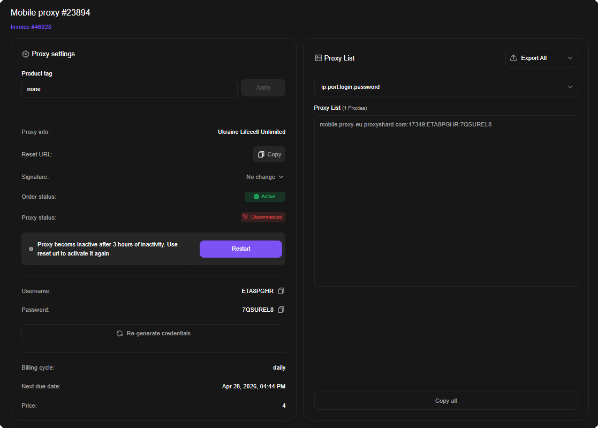
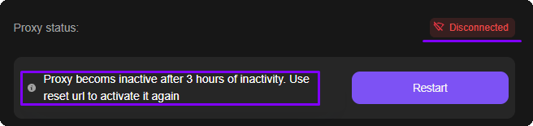

# 移动代理购买示例

## 购买代理

购买<mark style="color:purple;">移动代理</mark>时，选择适合您的资费（您可以使用国家过滤器对列表进行排序）并指定租赁期限，如下图所示

<figure><figcaption></figcaption></figure>

购买后，订单将自动打开，并可在“<mark style="color:purple;">活跃产品</mark>”面板或“[<mark style="color:purple;">我的订单</mark>](https://dashboard.proxyshard.com/products)”中查看

<figure><figcaption></figcaption></figure>

## 入门

<figure><figcaption></figcaption></figure>


**要使代理在购买后开始工作，请打开 **<mark style="color:purple;">**重置 URL**</mark>** 链接或单击按钮**  (1).png>)**.**\
\
_此外，如果代理超过三个小时没有活动，它们将被禁用，需要再次激活。_


<figure><figcaption></figcaption></figure>


您可以在此[链接](../../our-products/mobile-proxies.md)阅读有关设置和字段说明的信息


## 更新移动代理

该产品只能手动续订。\
\
禁用自动续订后，代理将等待手动付款（状态 <mark style="color:$warning;">On-Hold</mark>）。为此，请在订单中单击 .png>)

<figure><figcaption></figcaption></figure>


状态为“<mark style="color:$danger;">Cancelled</mark>”的代理无法续订。此状态会在订单未付款三天后分配。


