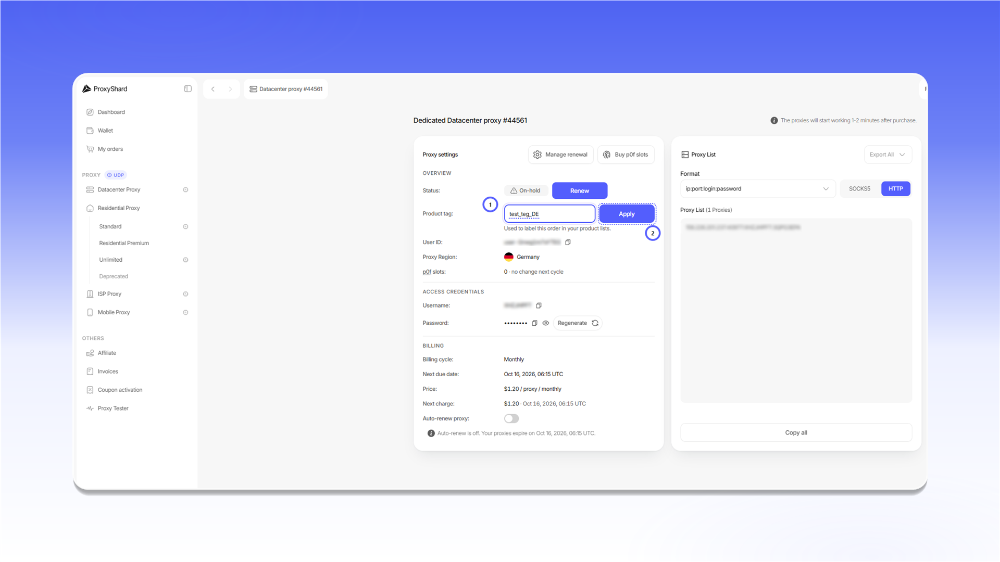
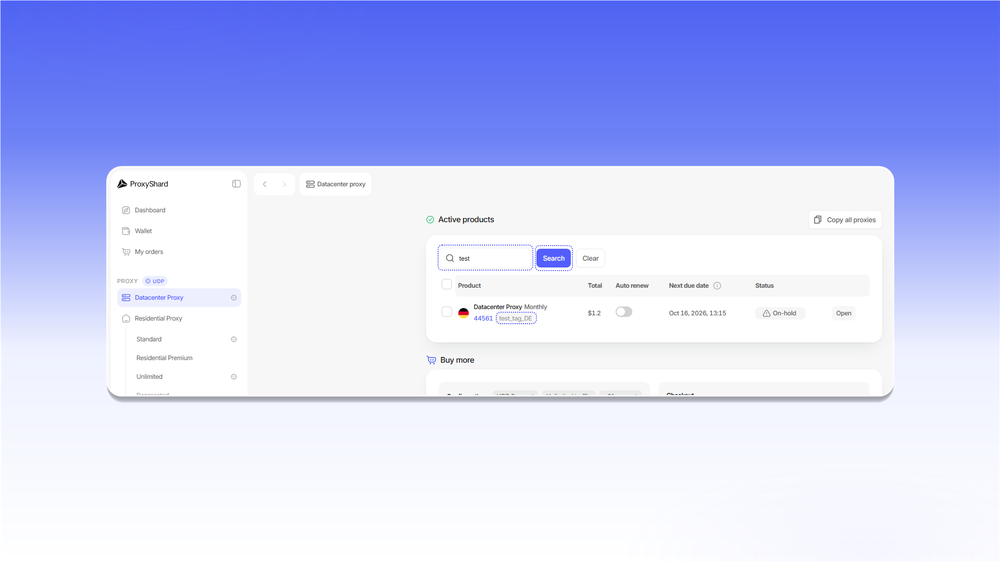
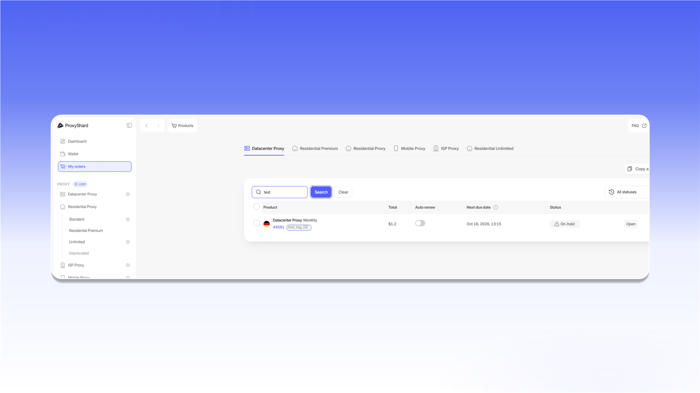

# 使用 Product tag 查找订单

您可以为每个订单设置自定义 `Product tag`，以便通过易识别的名称快速找到订单。

1. 打开订单，在 `Product tag` 中输入标签。
2. 点击 `Apply`。

<figure>
  <picture>
    <source srcset="../.gitbook/assets/product-tag-setup_black.png" media="(prefers-color-scheme: dark)">
    
  </picture>
</figure>

设置后的标签会显示在 `Active products` 中的订单编号旁边。

<figure>
  <picture>
    <source srcset="../.gitbook/assets/product-tag-active-search_black.png" media="(prefers-color-scheme: dark)">
    
  </picture>
</figure>

在 `Search` 中输入标签，然后点击 `Search`。您可以在对应产品页面和 [`My orders`](https://dashboard.proxyshard.com/products) 中使用此搜索功能。

<figure>
  <picture>
    <source srcset="../.gitbook/assets/product-tag-orders-search_black.png" media="(prefers-color-scheme: dark)">
    
  </picture>
</figure>

