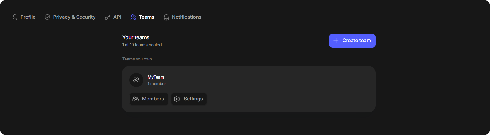

# 团队空间

Teamspaces 可让您与其他用户协作，共享代理访问权限，分配角色并在统一工作区中管理订单。

## 打开团队空间

1. 点击控制面板左下角的个人资料图标。
2. 选择 **Settings**，然后在顶部导航中打开 **Teams** 标签页。

<figure><figcaption></figcaption></figure>

## 管理团队

**Teams** 标签页会显示您创建的团队以及您加入的团队。您最多可以创建 10 个团队。

在您加入的团队中，可使用相应按钮切换当前团队或退出团队。

<figure><figcaption></figcaption></figure>

在您创建的团队中，可以管理成员并配置团队设置。

<figure><figcaption></figcaption></figure>

如果您是团队所有者，请在团队卡片上选择 **Settings** 来配置工作区设置：

<figure><figcaption></figcaption></figure>

## 添加成员

1. 打开团队并选择 **Members**。
2. 点击 **+ Add member**，然后输入用户的电子邮件地址。

<figure><figcaption></figcaption></figure>

3. 为成员配置所需的权限。

<figure><figcaption></figcaption></figure>
