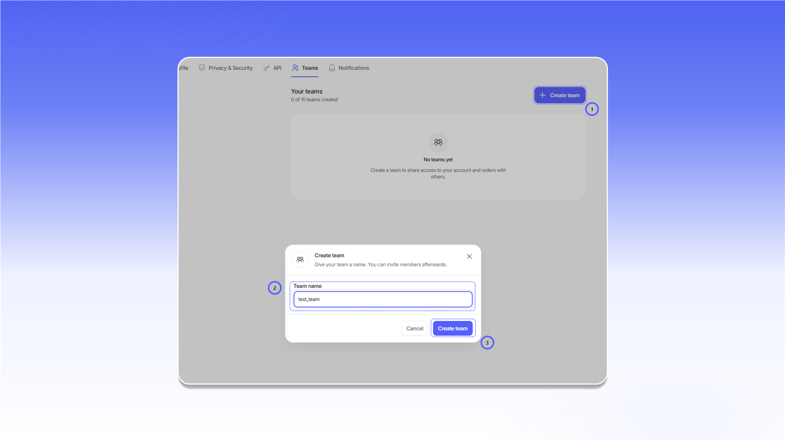

# 团队空间

团队功能可用于共享代理和订单访问权限、分配权限并在同一工作区中协作。一个账户最多可以创建 10 个团队。

## 打开 Teams

1. 点击左下角的个人资料图标。
2. 选择 `Settings`。
3. 打开 `Teams` 标签页。

<figure>
  <picture>
    <source srcset="../.gitbook/assets/teams-navigation_black.png" media="(prefers-color-scheme: dark)">
    
  </picture>
</figure>

## 创建团队

1. 点击 `Create team`。
2. 在 `Team name` 中输入团队名称。
3. 在创建窗口中点击 `Create team`。

<figure>
  <picture>
    <source srcset="../.gitbook/assets/team-create_black.png" media="(prefers-color-scheme: dark)">
    
  </picture>
</figure>

## 切换团队

打开左下角的账户菜单，选择 `Team`，然后选择目标团队。切换后，界面会显示该团队可访问的订单和功能。

<figure>
  <picture>
    <source srcset="../.gitbook/assets/team-switch_black.png" media="(prefers-color-scheme: dark)">
    
  </picture>
</figure>

您加入的团队会显示在 `Teams you belong to` 中。当前团队标记为 `Active`。如需退出团队，请点击 `Leave team`。

<figure>
  <picture>
    <source srcset="../.gitbook/assets/team-membership_black.png" media="(prefers-color-scheme: dark)">
    
  </picture>
</figure>

## 团队设置

团队所有者可以在团队卡片中打开 `Settings`，修改 `Team name`、启用 `Log order views` 或删除团队。更改设置后点击 `Save changes`。

<figure>
  <picture>
    <source srcset="../.gitbook/assets/team-settings_black.png" media="(prefers-color-scheme: dark)">
    
  </picture>
</figure>

## 添加成员

在自己的团队卡片中打开 `Members`，然后点击 `Add member`。接着：

1. 在 `Member email` 中输入电子邮件地址。
2. 设置订单访问权限和所需操作权限。
3. 点击 `Add member`。

<figure>
  <picture>
    <source srcset="../.gitbook/assets/team-add-member_black.png" media="(prefers-color-scheme: dark)">
    
  </picture>
</figure>
