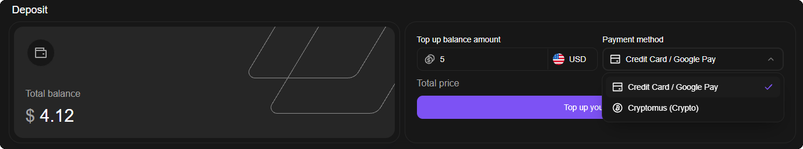

# 余额充值

添加资金是使用网站时最重要的一步。\
余额用于购买网站上的所有产品以及续订订单。\
\
目前支持以下充值方式：\
\- <mark style="color:purple;">加密货币</mark>，通过 Now payments\
\- <mark style="color:purple;">银行卡</mark>，通过Stripe\
\
如需充值您的钱包余额，请点击“[钱包](https://dashboard.proxyshard.com/en/wallet)”

在充值页面，您可以指定金额和付款方式。

<figure><figcaption></figcaption></figure>

选择付款方式：

<figure><figcaption></figcaption></figure>

充值页面还包含充值历史记录，您可以在其中查看已付款发票并导出每张发票的 PDF 文件。

<figure><figcaption></figcaption></figure>

