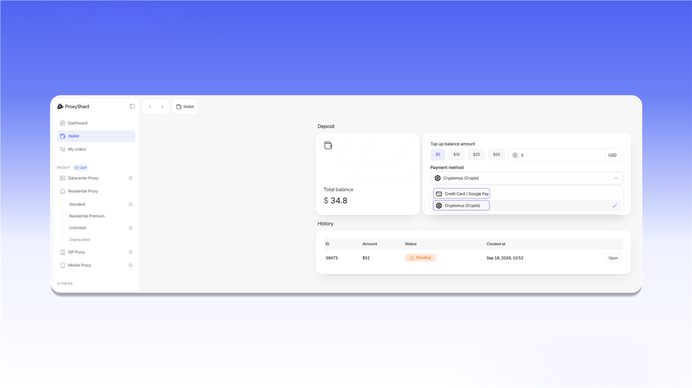

# 余额充值

余额可用于购买产品、续订订单以及支付额外流量。您可以通过 Stripe 使用银行卡或 Google Pay 充值，也可以通过 Cryptomus 使用加密货币充值。

充值步骤：

1. 打开 [`Wallet`](https://dashboard.proxyshard.com/en/wallet)。
2. 在 `Top up balance amount` 中输入充值金额。
3. 在 `Payment method` 中选择付款方式。
4. 点击 `Top up your balance` 并完成付款。

<figure>
  <picture>
    <source srcset="../.gitbook/assets/wallet-top-up-form_black.png" media="(prefers-color-scheme: dark)">
    
  </picture>
</figure>

`Payment method` 列表提供 `Credit Card / Google Pay` 和 `Cryptomus (Crypto)`。

<figure>
  <picture>
    <source srcset="../.gitbook/assets/wallet-payment-methods_black.png" media="(prefers-color-scheme: dark)">
    
  </picture>
</figure>

`History` 区域会显示每次充值的金额、状态和日期。点击 `Open` 可查看账单，并按需下载 PDF 文件。

